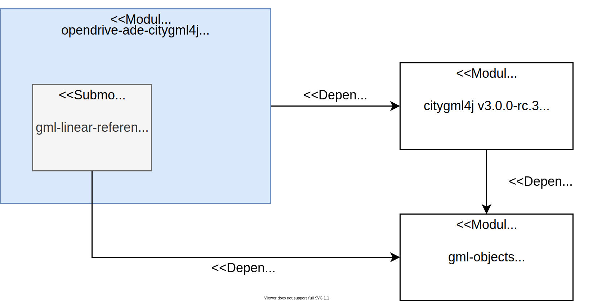

# opendrive-ade-citygml4j

> **_⚠:_** This is work-in-progress for a proof of concept.

## Overview
The opendrive-ade-citygml4j module implements the conceptual CityGML Application Domain Extension (ADE) model for the [ASAM OpenDRIVE 1.6 standard](https://www.asam.net/standards/detail/opendrive/). Is is built upon Claus Nagel's development branch of [Open Source Java API for CityGML3.0](https://github.com/citygml4j/citygml4j/tree/citygml3-devel).

## Module structure
The opendrive-ade-citygml4j module follows the package structure of the conceptual OpenDRIVE ADE. Additionally, a submodule is included implementing the [GML3.3](https://portal.ogc.org/files/?artifact_id=46568) encoding of the Linear Referencing model defined in the ISO19148 standard.

## Module dependencies
The opendrive-ade-citygml4 main module depends on [Open Source Java API for CityGML3.0](https://github.com/citygml4j/citygml4j/tree/citygml3-devel).
The submodule gml-linear-referencing directly builds upon Claus Nagel's [gml-objects](https://github.com/xmlobjects/gml-objects) GML implementation and extends it with GML3.3 Linear Referencing.

  

